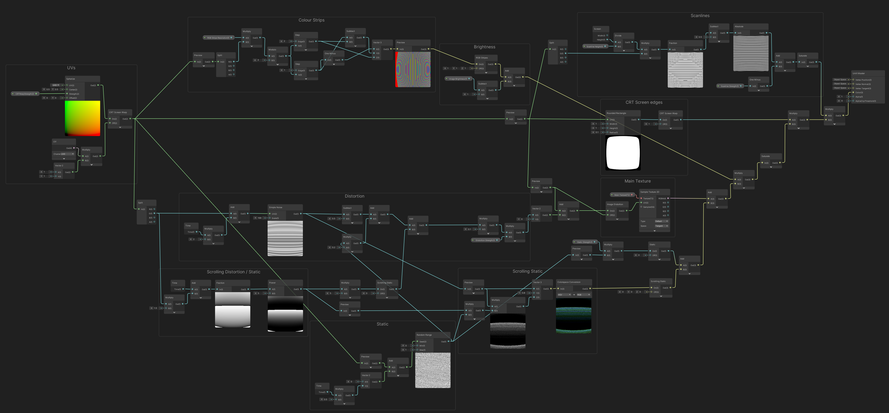

# Retro CRT Shader (for Universal RP)
A shader graph which replicates some retro tv/monitor effects. 

Most effects can be toggled on and off, uses shader_feature keywords to create multiple shader variants. Only used variants will be included in build. If you want to be able to toggle effects at runtime (using material.EnableKeyword), switch them to multi_compile keywords in the shadergraph blackboard instead. 
 
Effects include :  
• CRT (cathode-ray tube) monitor warping 
• Scanlines 
• Image Distortion 
• Static 
• Scrolling glitchy static 
• Vertical RGB subpixel / phosphor stripes 
 
Example also includes a multi-camera setup to render the scene to a low-resolution render texture, to achieve a pixelated look. The main camera's culling mask is set to nothing, so the scene isn't rendered twice, and it uses a different forward renderer which uses the Retro CRT Shader/material in an **Blit render feature** to apply it as an image effect, before additional post processing (**Vignette, Film Grain, Chromatic Aberration**). It could likely be applied to a regular mesh renderer too though, e.g. if you wanted to use it for a TV monitor. 
 
@Cyanilux 
:) 
 
If you aren't using URP / shadergraph but are interested in what the graph looks like, here's a high quality image instead :

I've also written up a blog post to attempt to explain parts of the graph a bit more : 
https://cyangamedev.wordpress.com/2020/09/10/retro-crt-shader-breakdown/
